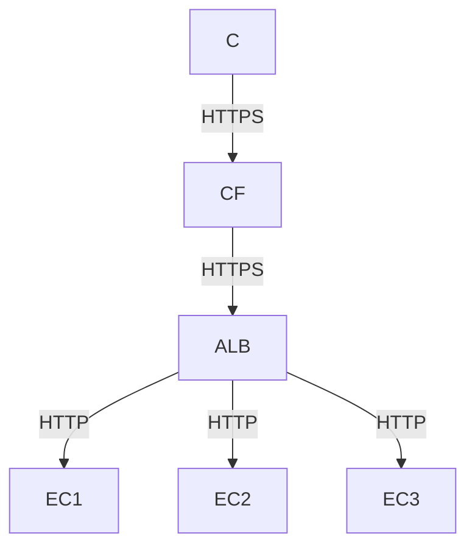

# 🌐 MERN Application Deployment Project on AWS with Cloudflare and AWS Load Balancer

- This project aims to deploy a production-ready MERN application on AWS, using separate EC2 instances for frontend and backend, NGINX as a reverse proxy, Cloudflare for secure public access, and an AWS Application Load Balancer to handle failures and distribute traffic.

## 🚀 Project Objectives and Scope

### Objectives

- Deploy a MERN application on AWS EC2 instances.
- Securely expose the application over HTTPS using Cloudflare.
- Use an AWS Application Load Balancer (ALB) so that backend failures on one instance do not cause downtime.
- Centralize traffic through NGINX, routing frontend and backend paths appropriately.

## 🧠 Tech Stack

### 🔹 Frontend
- React.js
- Axios
- CSS

### 🔹 Backend
- Node.js
- Express.js
- MongoDB (Atlas)
- Mongoose

### 🔹 DevOps & Infrastructure
- AWS EC2 (Compute)
- AWS Application Load Balancer (ALB)
- Nginx (Reverse Proxy + Static Hosting)
- PM2 (Process Manager)
- Cloudflare (DNS, CDN, SSL)

## 🏗️ Architecture Diagram


## 🔁Request Response Flow

    C[Client (Browser)]
    CF[Cloudflare (CDN + SSL)]
    ALB[AWS Application Load Balancer]
    EC1[EC2 Instance (NGINX + Node)]
    EC2[EC2 Instance (NGINX + Node)]
    EC3[EC2 Instance (NGINX + Node)]


## Phase 1: AWS Infrastructure Setup

- Create two Ubuntu 22.04 LTS EC2 instances in the same VPC:
  - One for the MERN frontend (React).
  - One for the MERN backend (Node.js/Express).
- Use `t2.micro` or similar instance types for cost-effective environments.
- Configure security groups to allow inbound:
  - SSH (port 22) from your IP.
  - HTTP (port 80) for NGINX.
  - Application ports (e.g., 3000 for frontend, 3001 for backend) for internal testing.
 
## Phase 2: MERN Application Deployment

### Backend (Express + MongoDB)

1. SSH into the backend EC2 instance.
2. Install Node.js and npm:
   ```bash
   sudo apt update
   sudo apt install -y nodejs npm
   ```
3. Clone the backend repository:
   ```bash
   git clone <YOUR_BACKEND_REPO_URL>
   cd <YOUR_BACKEND_FOLDER>
   ```
4. Configure MongoDB connection:
   ```bash
   export MONGO_URI="your_mongodb_uri"
   # optionally add to ~/.bashrc for persistence
   ```
5. Install dependencies and start the server:
   ```bash
   npm install
   node index.js
   ```


Backend access form browser 


6. (Recommended) Use pm2 to keep the backend alive:
   ```bash
   sudo npm install -g pm2
   pm2 start index.js --name mern-backend
   pm2 save
   pm2 startup systemd
   ```


### Frontend (React)

1. SSH into the frontend EC2 instance.
2. Install Node.js and npm:
   ```bash
   sudo apt update
   sudo apt install -y nodejs npm
   ```
3. Clone the frontend repository:
   ```bash
   git clone <YOUR_FRONTEND_REPO_URL>
   cd <YOUR_FRONTEND_FOLDER>
   ```
4. Configure API base URL to point to the backend (later via NGINX/ALB, e.g. `/api`).
5. Install dependencies and start the dev server:
   ```bash
   npm install
   npm start
   ```
6. For production, build the React app and serve it through NGINX or a dedicated Node server:
   ```bash
   npm run build
   ```


Frontend Access from the browser


## Phase 3: NGINX Reverse Proxy Configuration

Install and configure NGINX on a chosen entry-point instance (often the frontend EC2):

1. Install NGINX:
   ```bash
   sudo apt update
   sudo apt install -y nginx
   ```
2. Edit the default site configuration:
   ```bash
   sudo nano /etc/nginx/sites-available/default
   ```
3. Example configuration:
   ```nginx
   server {
       listen 80;

       location /api {
           proxy_pass http://<BACKEND_PRIVATE_IP>:<BACKEND_PORT>;
       }

       location / {
           proxy_pass http://<FRONTEND_PRIVATE_IP>:3000;
       }
   }
   ```
4. Test and reload:
   ```bash
   sudo nginx -t
   sudo systemctl reload nginx
   ```

At this point, HTTP requests to the EC2 public IP on port 80 should load the frontend, and `/api` calls should be proxied to the backend.


## Phase 4: Secure Hosting with Cloudflare

1. Add your domain to Cloudflare.
2. Update nameservers at your domain registrar to the Cloudflare nameservers.
3. In Cloudflare DNS, create:
   - `A` record for `@` pointing to your NGINX/entry EC2 public IP (or ALB later).
   - `A` record for `www` pointing to the same target.
4. In Cloudflare SSL/TLS settings:
   - Choose an SSL mode (e.g., Flexible or Full).
   - Enable "Always Use HTTPS" if desired.

All external access to the MERN app now flows through Cloudflare using HTTPS.


### 🌐 Live URL
```
https://anilkumarrajana.qzz.io/addexperience
```
## Phase 5: High Availability with AWS Application Load Balancer

To handle backend failures and distribute load, introduce an AWS ALB in front of multiple backend instances:

1. Launch one or more additional EC2 instances with the same code and configuration.
2. Create a Target Group:
   - Type: Instances.
   - Protocol: HTTP.
   - Port: backend port (e.g., 3001).
   - Health check path: `/api/health` or similar.
   - Register all backend instances.
3. Create an Application Load Balancer:
   - Scheme: Internet-facing or internal (depending on architecture).
   - At least two subnets in different AZs.
   - Listener on port 80 forwarding to the backend target group.
4. Update NGINX to forward `/api` traffic to the ALB instead of a single EC2:
   ```nginx
   location /api {
       proxy_pass http://<BACKEND_ALB_DNS_NAME>;
   }
   ```
5. Test and reload NGINX:
   ```bash
   sudo nginx -t
   sudo systemctl reload nginx
   ```

If one instance fails, the ALB health checks will mark it as unhealthy and stop sending traffic to it, improving availability.

## Phase 6: Monitoring, Failure Handling, and Troubleshooting

- Use browser DevTools to inspect frontend network calls and confirm `/api` requests succeed.
- Inspect NGINX logs:
  ```bash
  sudo tail -f /var/log/nginx/access.log
  sudo tail -f /var/log/nginx/error.log
  ```
- To troubleshoot `502 Bad Gateway`:
  - Confirm backend processes are running.
  - Confirm NGINX `proxy_pass` targets are reachable with `curl` from the NGINX host.
  - Verify ALB target group health status in the AWS console.

## Project Completion Checklist

- [ ] MERN backend deployed and running on at least one EC2 instance behind an ALB.
- [ ] MERN frontend deployed and accessible via the configured domain.
- [ ] NGINX reverse proxy correctly routes `/` to frontend and `/api` to backend (or backend ALB).
- [ ] Cloudflare DNS and SSL are configured; application is accessible over HTTPS.
- [ ] ALB health checks are configured and passing for backend instances.
- [ ] Simulated failure of one backend instance does not cause application downtime.


